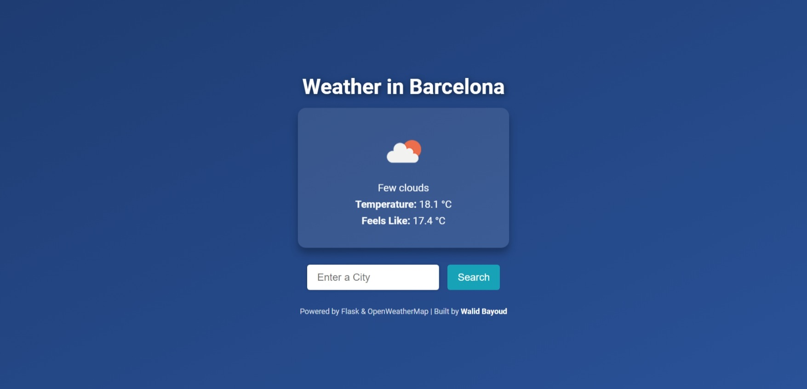
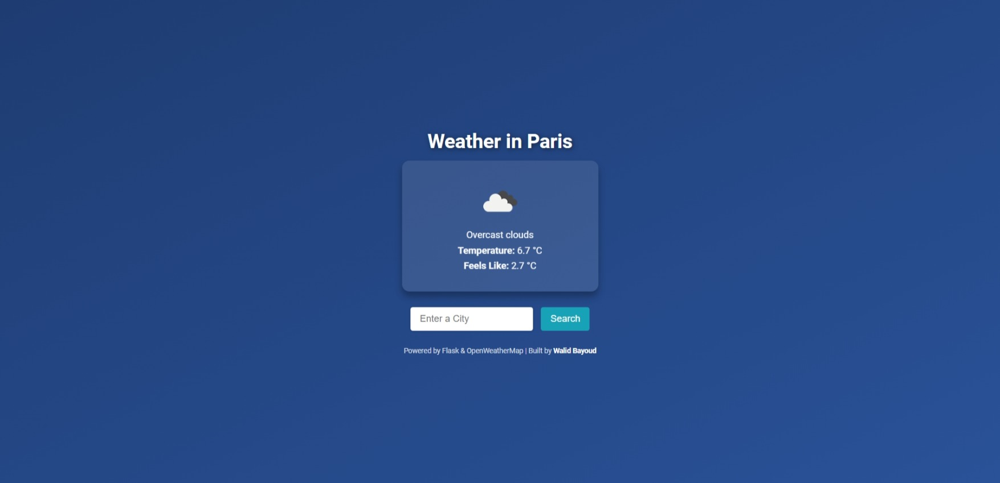
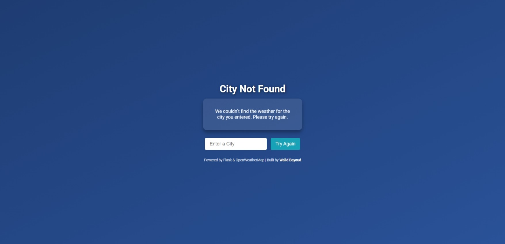

# City Weather 🌤️

City Weather is a simple Flask web application that fetches and displays the current weather conditions for any city using the OpenWeatherMap API. 

 


## Features

- Displays weather information such as temperature, "feels like" temperature, and weather description.
- Fetches weather data dynamically for any city.
- Graceful handling for invalid city names with a custom "City Not Found" page.
- Responsive and clean UI built with custom CSS.

---
## Live Demo

Try the live application here: [City Weather on Render](https://cityweather-sdoy.onrender.com/)  

---

## Technologies Used

- **Backend:** Python, Flask, Waitress
- **Frontend:** HTML, CSS (with Flexbox), Jinja2 templates
- **API:** [OpenWeatherMap API](https://openweathermap.org/)
- **Deployment:** Waitress web server

---

## Setup and Installation

### Prerequisites
- Python 3.11.2 installed
- OpenWeatherMap API key (sign up [here](https://home.openweathermap.org/users/sign_up))

### Steps
1. Clone the repository:
   ```bash
   git clone https://github.com/walidbayoud/CityWeather.git
   cd CityWeather
   
2. Install dependencies:
   ```bash
   pip install -r requirements.txt
3. Create a .env file and add your OpenWeatherMap API key:
   ```bash
   API_KEY=your_openweathermap_api_key

4. Run the application:
   ```bash
   python server.py

5. Open the app in your browser at:
   ```bash
   http://127.0.0.1:8000


---
## Deployment

The application is hosted on **Render**, a cloud platform for deploying web applications.

You can access the live application here: [City Weather on Render](https://cityweather-sdoy.onrender.com/)  

To deploy this application on **Render**, follow these steps:

1. **Connect Your GitHub Repository**  
   - Go to [Render](https://render.com/).
   - Create a new web service and connect it to your GitHub repository.

2. **Set Environment Variables**  
   - Add your `API_KEY` for OpenWeatherMap in the "Environment Variables" section of Render.

3. **Choose a Build Command**  
   ```bash
   pip install -r requirements.txt

4. **Choose a Start Command**
   ```bash
   python server.py
5. **Deploy Your Application**  
   Render will automatically build and deploy your app.  
   Once the deployment is complete, your app will be live at the provided Render URL.


---

## Usage

1. Enter a city name in the search box.  
2. View the weather details, including:  
   - Temperature  
   - Weather description  
   - An icon representing the conditions  
3. If the city is not found, you'll be shown a helpful error page.


## Screenshots






## Credits

- **Built by**: [Walid Bayoud](https://www.linkedin.com/in/walidbayoud)  
- **Powered by**: Flask & OpenWeatherMap

## License

This project is licensed under the **MIT License**.  
Feel free to use and modify it as you like!

